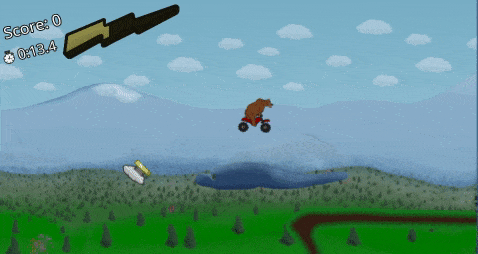

# bearcycle

bearcycle® combines fast-paced motorcycle racing with wacky platforming madness. This was a personal project that was released on Steam, you can check it out there. https://bearcyclegame.com

The code in this repo is just the basic motorbike physics with some placeholder graphics. I eventually split it off into a private repo for continued development, music, artwork etc.

## About

I am a professional software developer who has always wanted to create and release a complete video game. And I did it! It's on steam :)

For my game engine, I am using [Godot](https://godotengine.org/) 3.X Mono (Lets me write `C#` instead of `GDScript`). For music, I am using [Reaper](https://www.reaper.fm/) with mostly free virtual instruments. This repository just contains the code and basic Godot project files for simple motorbike physics. All other artwork/assets/music are not included.

See the "Releases" section of this repo for various "checkpoints" on creating the basic motorbike physics. Each release contains a gif: https://github.com/alvariusgames/bearcycle/releases

## Backstory

The idea for this game came when I was hiking with friends in Alaska on a multi-use trail (we were on foot, but there were people on off-road vehicles like ATVs). When hiking, we encountered two black bears about 30 feet in front of us. We followed the correct protocols and slowly backed away. While anxiously waiting for the bears to leave, I heard the faint sound of an ATV in the distance coming towards us on the trail. In that heightened emotional state, my immediate thought was "\$\#\%\@\#, the bear commandeered an ATV and is coming for us". I became infatuated with that mental image of a 500 lb beast hurling towards me at 60 mph on a metal death machine. Who can stop that?

## License

Everything on this https://github.com/ludditegames/bearcycle.git repository is under the MIT open source license. It's just the source code for basic motorbike physics, please don't use anything from the released game that you can't find in this repo. Thanks! 
